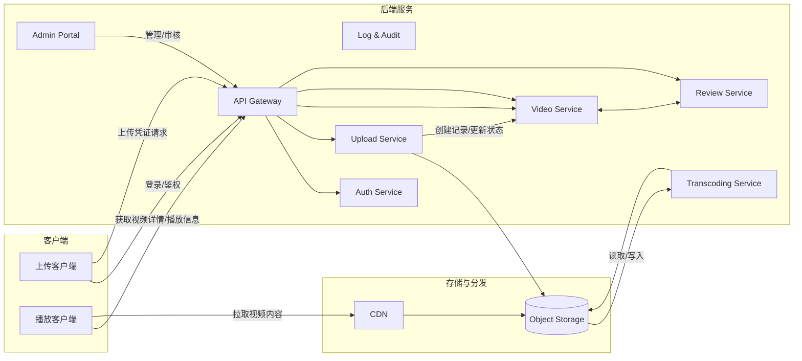

## 用户生成视频 & 对外流出功能文档（PRD + 数据流设计 · 完整版）

> 说明：本 Markdown 文档融合了「产品需求文档（PRD）」和「数据流/架构说明」，你可以直接保存为使用或二次修改。

---

## 一、文档信息

- **文档名称**：用户生成视频 & 对外流出功能 PRD + 数据流设计  
- **版本号**：v1.0.0  
- **作者**：`<填写>`  
- **评审人**：`<产品> / <技术> / <安全> / <运营>`  
- **创建日期**：`<填写>`  
- **最近更新**：`<填写>`  

---

## 二、背景与目标

### 2.1 背景

- 平台允许用户上传/拍摄视频，在站内展示和在站外传播（分享链接、嵌入等），属于典型 UGC 视频业务场景。
- 当前或即将上线的功能中，涉及：
  - 用户上传 → 存储 → 转码 → 审核 → 发布/播放 → 分享/嵌入/下载 等完整链路。
  - “视频流出”（视频离开平台直接被访问/传播）的路径、边界和风险。
- 需要一份统一的产品+技术说明，支撑：
  - 产品评审、技术设计、安全评估、合规审查与后续运维。

### 2.2 目标

- **业务目标**
  - 支持用户便捷地上传、管理、发布视频内容。
  - 提升视频在站内、站外的传播能力（分享链接、嵌入播放等）。
  - 为后续运营、分析提供必要数据（播放、分享、流出来源等）。
- **安全与合规目标**
  - 明确视频从产生到对外流出的**端到端数据流**。
  - 识别并控制关键风险点（未授权访问、批量下载、内部滥用等）。
  - 满足内容安全、隐私与本地法律法规要求。

---

## 三、范围说明

### 3.1 本期范围（In Scope）

- **用户端**
  - 视频上传、信息编辑、可见性配置、发布/下线。
  - 视频观看、分享链接生成、（如有）下载。
- **后台/内部**
  - 视频内容审核（机器 & 人工）、状态流转。
  - 对视频可见性和对外流出策略（外链/嵌入/下载）进行配置。
  - 审计与日志：上传、播放、分享、下架、权限变更等。
- **技术/安全**
  - 上传/存储/播放/分享的接口设计。
  - 基本访问控制（鉴权、签名 URL、防盗链等）。
  - 数据流梳理与风险点说明。

### 3.2 非本期范围（Out of Scope）

- 实时直播（Live）相关功能。
- 付费内容、会员专属视频的计费、订单与结算逻辑。
- 复杂推荐算法与排序策略（默认只需基础列表/详情能力）。

---

## 四、角色与术语

### 4.1 角色

- **上传用户（内容创作者）**：在平台上传或创作视频内容。
- **浏览用户（内容消费者）**：在平台内或通过分享观看视频。
- **审核/运营人员**：在后台对视频进行审核、下架、封禁等操作。
- **安全/风控人员**：对视频流出路径和访问行为进行审计与风险控制。
- **第三方合作方**：如 CDN、云转码服务、外包审核等。

### 4.2 术语

- **UGC**：User Generated Content，用户生成内容。
- **原始视频（Raw Video）**：用户上传的未处理视频文件。
- **转码视频（Transcoded Video）**：转码后的多码率/多格式视频，用于播放分发。
- **播放地址（Playback URL）**：播放器用来拉取视频内容的实际文件或清单 URL（如 m3u8、MP4）。
- **视频流出**：视频或其内容通过站外链接、嵌入、下载等方式被访问/传播。

---

## 五、系统组件与架构概览

### 5.1 系统组件

- **客户端**
  - `Web 客户端`: 浏览器页面。
  - `移动客户端`: iOS / Android App。
- **后端服务**
  - `API Gateway`：统一入口，负责认证、限流与基础安全。
  - `Auth Service`：身份认证与授权。
  - `Video Service`：视频元数据和业务逻辑管理。
  - `Upload Service`：上传凭证发放、上传回调处理。
  - `Transcoding Service`：视频转码和处理。
  - `Review Service`：视频内容审核（机器 + 人工）。
  - `Admin Portal`：运营/审核/安全使用的管理后台。
  - `Log & Audit`：日志收集与审计分析。
- **存储与分发**
  - `Object Storage`：对象存储（原始视频、转码视频、封面图）。
  - `CDN`：内容分发网络，加速视频访问。

### 5.2 逻辑架构图（Mermaid）

---

## 六、数据对象设计

### 6.1 核心数据模型：视频

- **表/集合：`video`**
  - **字段示例**
    - `id`：视频唯一标识
    - `uploader_id`：上传用户 ID
    - `title`：标题
    - `description`：描述
    - `tags`：标签列表
    - `cover_url`：封面图片 URL
    - `status`：`draft` / `reviewing` / `approved` / `rejected` / `blocked`
    - `visibility`：`public` / `private` / `unlisted` / `friends_only` 等
    - `raw_object_key`：原始视频在对象存储中的 key
    - `transcoded_playlist_url`：转码后主播放地址（m3u8 或 DASH 清单）
    - `duration`：视频时长（秒）
    - `size`：原始视频大小（字节）
    - `allow_external_embed`：是否允许外站嵌入（历史字段，实际以 `external_access_policy` 为准）
    - `allow_download`：是否允许下载（历史字段，实际以 `external_access_policy` 为准）
    - `external_access_policy`：视频对外访问策略（JSON，见下文 6.5），内含会员等级与下载/嵌入能力
    - `created_at` / `updated_at`
  - **敏感等级**
    - 中 ~ 高：包含未发布内容和可能含有个人隐私信息的视频。

### 6.2 上传日志

- **表：`video_upload_log`**
  - `id`
  - `video_id`
  - `uploader_id`
  - `client_ip`
  - `user_agent`
  - `device_info`
  - `upload_start_at`
  - `upload_end_at`
  - `upload_status`（成功/失败/中断）
  - `error_code` / `error_message`
  - **敏感等级**：中（含 IP、设备信息）。

### 6.3 播放/访问日志

- **表：`video_play_log`**
  - `id`
  - `video_id`
  - `viewer_id`（游客可为空）
  - `client_ip`
  - `user_agent`
  - `play_timestamp`
  - `play_duration`
  - `referer`
  - `source_type`（站内/分享链接/嵌入/下载等）
  - `cdn_node`
  - **敏感等级**：中。

### 6.4 审核与操作日志（简要）

- **审核表：`video_review`**
  - 审核状态、审核人、审核时间、审核原因等。
- **操作审计表：`video_operation_log`**
  - 包含下架、删除、可见性变更、流出策略变更、后台导出等关键操作。

### 6.5 对外访问策略与流出审计

- **对外访问策略：`external_access_policy`**（可为 `video` 表 JSON 字段或单独表）
  - 示例结构：
    - `allow_share`: 是否允许分享链接
    - `allow_embed`: 是否允许嵌入播放
    - `allow_download`: 是否允许下载
    - `download_requires_membership`: 允许下载的最低会员等级（如：`"basic"` / `"pro"`）
    - `embed_domains`: 允许嵌入的域名白名单（数组）
    - `expires_at`: 策略过期时间（如仅在某一时间前可对外访问）
  - 说明：
    - 将“视频流出”抽象为**一项显式能力**，而非播放的副作用。
    - 会员等级（如免费/4.9 会员/高端会员）通过该策略解锁不同的嵌入与下载能力，做到“安全默认收紧，会员解锁能力”。

- **流出审计日志：`video_external_access_log`**
  - **用途**：回答“这个视频，什么时候、以什么形式、被谁允许流出过？”这一关键合规问题。
  - 字段示例：
    - `id`
    - `video_id`
    - `type`：`share` / `embed` / `download`
    - `initiator_type`：`user` / `admin` / `system`
    - `initiator_id`：触发人 ID（如有）
    - `policy_snapshot`：当时 `external_access_policy` 快照（JSON）
    - `created_at`
  - **敏感等级**：中 ~ 高（涉及访问策略与操作人信息）。

---

## 七、端到端数据流

### 7.1 高层数据流步骤

1. 用户登录客户端。
2. 用户请求上传凭证。
3. 用户将视频上传到对象存储（或经过上传服务中转）。
4. 上传完成后，服务端记录元数据和上传日志。
5. 触发转码流程，生成多码率/格式视频及封面。
6. 触发内容审核（机器/人工），决定是否可发布。
7. 审核通过后，视频可根据可见性配置被访问和播放。
8. 用户可分享视频链接、生成嵌入代码，或（如允许）下载视频。
9. 所有访问和关键操作均被记录用于审计和分析。

### 7.2 上传阶段数据流

- **步骤**
  1. 客户端 → `API Gateway`：请求 `POST /api/videos/upload-token`
  2. `API Gateway` → `Auth Service`：校验用户身份。
  3. `Upload Service` 生成上传凭证（短期有效）、目标 bucket 和 key 前缀。
  4. 客户端使用凭证向 `Object Storage` 上传视频（支持分片、断点续传）。
  5. 上传完成后，由 `Object Storage` 事件或客户端回调通知 `Upload Service`。
  6. `Upload Service` 创建 `video` 记录（状态：`reviewing` 或 `draft`），写入 `video_upload_log`。

- **传输安全**
  - 全链路 HTTPS。
  - 上传凭证仅允许指定 bucket/key 前缀，且有过期时间和大小限制。

### 7.3 存储与转码阶段数据流

- **存储**
  - 原始视频：`raw/{user_id}/{video_id}/{filename}`
  - 转码输出：`processed/{video_id}/{resolution}/segment_xxx.ts` 等。
  - 封面图：`cover/{video_id}.jpg`

- **转码**
  1. `Transcoding Service` 监听上传完成事件。
  2. 从 `Object Storage` 拉取 `raw_object_key`。
  3. 生成多分辨率 HLS 切片、m3u8 文件，及首帧封面。
  4. 结果写回 `Object Storage`，更新 `video.transcoded_playlist_url`。
  5. 通知 `Video Service` 更新状态/元数据。

### 7.4 审核阶段数据流

1. `Video Service` 将新视频状态置为 `reviewing` 并发送审核任务给 `Review Service`。
2. `Review Service` 使用机器模型检测涉黄、涉暴、涉政、版权等问题。
3. 根据策略：
   - 直接自动通过；
   - 直接自动拒绝；
   - 标记为“需人工复审”。
4. 人工审核通过后台 `Admin Portal` 对指定视频进行确认操作。
5. 审核结果写回：
   - `video.status` 更新为 `approved / rejected / blocked`。
   - 写入 `video_review` 表。

### 7.5 播放与视频流出阶段数据流

- **播放信息获取**
  1. 客户端请求：`GET /api/videos/{id}`。
  2. `Video Service` 统一调用**视频访问决策中枢**（见第十章）进行决策：
     - 视频状态（必须为 `approved` 且非 `blocked`）。
     - 可见性与用户身份匹配（公开/私密/仅链接/好友等）。
     - 请求类型（播放 / 嵌入 / 下载）与 `external_access_policy` 是否匹配。
  3. 若决策结果为允许访问：
     - 视频元数据（标题、描述、封面等）。
     - 播放地址（CDN 域名 + `transcoded_playlist_url` + 鉴权参数）。
     - 当前是否允许分享、嵌入、下载等配置。
    若不允许访问，则返回对应错误码与原因（如：未审核/无权限/被下架等）。

- **CDN 拉流**
  - 播放器根据返回的 URL 访问 `CDN`。
  - `CDN` 校验签名、防盗链（Referer/IP/UA 等策略）。
  - 如缓存未命中，则回源至 `Object Storage` 获取资源。
  - 行为日志采集到 `Log & Audit` 系统。

- **视频流出形式**
  - **预期流出**
    - 分享视频详情页 URL。
    - 通过 iframe/embed 代码在其他网站中嵌入播放。
    - 通过下载接口在本地保存（仅对满足策略与会员等级的用户开放）。
  - **非预期/风险流出**
    - 爬虫批量抓取直链 URL。
    - CDN 或存储权限误配置导致任意访问。
    - 内部人员通过后台导出/下载未授权视频。

---

## 八、产品功能需求（PRD）

### 8.1 用户端功能

- **F-01 视频上传**
  - 支持选择本地文件或拍摄视频。
  - 文件格式与大小限制有明确提示（如：支持 mp4/mov，最大 1GB）。
  - 展示上传进度；失败时展示错误原因，允许重试（最多 N 次，可配置）。

- **F-02 视频信息编辑**
  - 字段：标题（必填）、描述（选填）、标签（选填）、封面（自动截取 + 手动上传）。
  - 校验：
    - 标题长度限制。
    - 敏感词/非法字符过滤。

- **F-03 可见性设置**
  - 可选值：
    - `公开`
    - `仅本人可见`
    - `仅持链接可见`
    - `好友可见`（如有社交关系）
  - 用户可在上传时设置，也可在详情页后续修改。
  - 修改后立刻影响访问控制逻辑。

- **F-04 视频播放**
  - 访问视频详情页时，自动加载播放器播放。
  - 无权访问时，展示相应提示（例如：“该视频不可见”）。

- **F-05 分享能力**
  - 详情页提供“复制链接”按钮。
  - 复制内容为视频详情页 URL（可为短链）。
  - 若视频为 `仅本人可见`，可默认隐藏分享按钮或点击提示“当前不可分享”。

- **F-06 嵌入代码（可选）**
  - 提供 iframe/embed 代码。
  - 可见性与后台的 “允许嵌入” 策略共同决定该功能是否展示。

- **F-07 下载能力（可选）**
  - 如产品允许下载：
    - 详情页提供“下载”按钮。
    - 后端返回短期有效的下载签名 URL。
  - 若平台不希望下载，需可通过全局配置/策略关闭此功能。

### 8.2 后台/管理功能

- **F-08 审核列表 & 详情**
  - 展示待审核/已审核视频列表。
  - 支持按状态、时间、用户 ID 等筛选。
  - 详情中展示视频基础信息、封面、审核建议（来自机器模型）。

- **F-09 审核操作**
  - 审核通过：视频状态更新为 `approved`。
  - 审核拒绝：设置状态为 `rejected`，记录原因。
  - 审核后应通知上传用户（站内信/Push，可选）。
  - 支持批量审核（可选）。

- **F-10 违规处理与下架**
  - 后台可将视频设为 `blocked` 或 `仅本人可见`。
  - 前台被下架视频不再可访问或仅上传者自己可见。
  - 所有操作必须有操作日志（操作人、时间、原因）。

- **F-11 流出策略配置**
  - 每个视频/全局配置项：
    - 是否允许外链访问（非站内入口）。
    - 是否允许嵌入播放。
    - 是否允许下载。
  - 支持批量变更（如对某一类内容关闭下载）。

- **F-12 审计与访问记录查询**
  - 按 `video_id` 或 URL 查询：
    - 上传者信息。
    - 状态、可见性、流出策略历史。
    - 访问统计（播放量、来源、地域等聚合数据）。
  - 对高危操作（导出/下载）提供专门审计视图。

---

## 九、埋点与指标

### 9.1 指标

- **上传漏斗**
  - 开始上传 → 上传成功 → 提交信息 → 审核通过。
- **消费指标**
  - 播放次数、独立观看人数、平均播放时长。
  - 来源分布：站内入口、分享链接、嵌入页面等。
- **风控指标**
  - 下架/封禁的视频数量及占比。
  - 异常访问模式（单 IP/单视频高频访问）。

### 9.2 埋点事件（示例）

- **用户行为**
  - `video_upload_start` / `video_upload_success` / `video_upload_fail`
  - `video_publish`（审核通过且上线）
  - `video_play`（含来源字段）
  - `video_share_click`
  - `video_download_click`
- **管理操作**
  - `video_visibility_change`
  - `video_block`
  - `video_flow_policy_change`（外链/嵌入/下载配置变更）

---

## 十、权限与访问控制

- **用户级**
  - 每个视频以 `video_id` 为资源单位。
  - 使用 `visibility` + 用户身份判断访问权限。
- **后台级**
  - 角色：`admin` / `reviewer` / `ops` / `security` 等。
  - 按角色限制可进行的操作（查看、修改、导出、下架等）。
- **对象存储 & CDN**
  - 对象存储默认私有读，禁止匿名 List。
  - CDN 采用 URL 签名 + 过期时间；启用 Referer/IP/UA 防盗链策略。

---

## 十一、视频访问决策与流出控制（强制执行点）

> 本节定义“访问决策中枢”和“强制控制点”，用于保证所有访问路径都经过一致的权限与策略校验。

### 11.1 视频访问决策中枢（VideoAccessDecision）

- **概念**：一个逻辑服务/函数，不一定是独立服务，但在架构上应视为**唯一入口**，用于判断“某个请求是否能以某种方式访问某个视频”。
- **输入示例**：
  - `video_id`
  - `requester`：
    - `user_id`（可为空，表示游客）
    - `role`（如：user/admin/reviewer/security）
    - `is_admin`（布尔值，可选）
  - `request_type`：`play` / `embed` / `download`
  - `source`：`internal` / `share` / `embed`
- **输出示例**：
  - `allow`: `true` / `false`
  - `playback_url`: 若允许播放时生成的签名 URL（如适用）
  - `reason`: `"NOT_FOUND"` / `"NO_PERMISSION"` / `"BLOCKED"` / `"NOT_REVIEWED"` / `"EXPIRED"` 等
- **强制要求**：
  - 所有与视频相关的访问（播放、嵌入、下载）必须通过此决策逻辑。
  - 在审核通过前，**不得**返回可用的播放/下载 URL，即使已有转码结果。

### 11.2 对外流出控制

- **统一使用 `external_access_policy`**：
  - `allow_share` = false 时，前端不展示分享按钮，后端也不生成分享链接。
  - `allow_embed` = false 时，不生成/embed URL，CDN/后端对该类型请求直接拒绝。
  - `allow_download` = false 时，一律不生成下载签名 URL。
- **嵌入控制强化**：
  - 嵌入 URL 必须携带签名和过期时间。
  - 校验 `embed_domains` 白名单；非法域名嵌入请求一律拒绝。
  - 所有嵌入访问需在 `video_external_access_log` 中可追踪。

### 11.3 流出行为审计锚点

- 对以下行为必须记录审计日志（`video_external_access_log` 或等价机制）：
  - 分享链接生成（含当时的策略快照）。
  - 嵌入代码生成或启用。
  - 下载链接生成。
- 审计数据需支持：
  - 按 `video_id` 查询所有流出行为。
  - 在安全/合规审计中作为“这一视频为何能流出”的直接证据。

---

## 十二、风险分析与控制

### 12.1 主要风险点

- **对象存储/桶误配置为公共读**：导致所有原始/转码视频可被直接访问下载。
- **CDN 链接长期有效，无签名**：便于被爬虫批量抓取。
- **未审核视频被错误暴露**：引发内容安全和合规风险。
- **内部人员滥用权限导出或下载敏感视频**：造成内部泄露。
  - 典型场景：运营/技术“顺手导出”或“用测试账号访问真实数据”。

### 12.2 对应控制措施

- **存储与分发**
  - 严格控制对象存储权限，统一由基础架构维护。
  - 定期扫描 bucket/CDN 配置并告警异常公开访问。
  - 所有播放/下载必须经过签名 URL，限制有效期和可访问资源范围。

- **访问与使用**
  - 默认关闭下载功能，仅在业务必要时开放。
  - 为高价值内容配置更短过期时间与更严格访问策略。
  - 对异常访问（高频请求、集中某地区等）接入风控策略（如限速/封禁）。

- **内部治理**
  - 最小权限原则分配后台/运维/开发权限。
  - 高危操作（导出、批量下架等）要求双人审批或强审计。
  - 定期审计操作日志，对异常操作行为进行排查；`video_external_access_log` 作为重点审查对象。

---

## 十三、非功能性需求

- **性能**
  - 上传过程要持续有进度反馈，避免超过 3 秒无响应。
  - 播放首帧加载建议 ≤ 2 秒（正常网络 & CDN 命中场景）。
- **可用性**
  - 年度可用性目标 99.9%。
  - 接口设计需支持幂等和重试机制。
- **安全**
  - 全站 HTTPS。
  - 所有临时访问凭证（上传凭证、下载 URL、播放签名）需有明确过期时间。
- **合规**
  - 提供删除视频和关闭分享能力，删除后需考虑缓存/CDN 的一致性处理。
  - 对包含未成年人、敏感个人信息的视频实施更严格保护策略。

---

## 十四、开放接口（示例）

> 仅列关键接口名称，实际项目中可补充请求方式、参数、返回结构与错误码。

- **上传**
  - `POST /api/videos/upload-token`：获取上传凭证。
  - `POST /api/videos/upload-callback`：上传完成回调。
- **视频管理**
  - `POST /api/videos`：创建/提交视频信息。
  - `PATCH /api/videos/{id}`：更新标题/描述/可见性等。
  - `GET /api/videos/{id}`：获取视频详情与播放信息。
- **分享/下载**
  - `GET /api/videos/{id}/share-link`：获取分享链接。
  - `GET /api/videos/{id}/download`：获取下载签名 URL（如有）。
- **后台**
  - `GET /api/admin/videos`：审核/管理视频列表。
  - `POST /api/admin/videos/{id}/review`：审核操作。
  - `POST /api/admin/videos/{id}/block`：违规下架。
  - `GET /api/admin/videos/{id}/audit`：查看访问和操作日志摘要。

---

## 十五、里程碑与依赖

- **里程碑**
  - M1：PRD & 架构评审通过
  - M2：交互 & 视觉稿完成
  - M3：后端接口与存储/CDN方案评审通过
  - M4：开发 & 联调完成
  - M5：灰度发布 & 验证
  - M6：全量上线

- **依赖**
  - 统一鉴权系统（用户登录/权限）。
  - 对象存储与 CDN 基础能力。
  - 内容审核服务（自研或第三方）。
  - 日志与审计平台。

